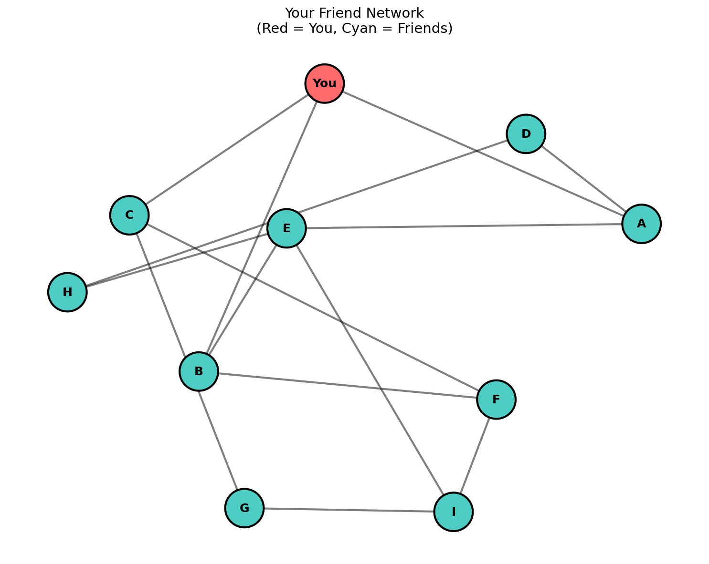

# 推しの布教ネットワーク最適化 with 量子コンピュータ

中性原子量子コンピュータ（シミュレータ）を使って、「推しを最も効率よく広める布教ターゲット」を計算するプロジェクトです。

## 概要

友達ネットワークで「誰に布教すれば最も効率よく推しが広まるか」を、中性原子量子コンピュータのリュードベリ封鎖を利用して最大独立集合（MIS）問題として解きます。



## 技術スタック

- **Pulser**: Pasqal社の中性原子量子コンピュータSDK
- **QuTiP**: 量子シミュレーションバックエンド
- **NetworkX**: グラフ操作

## セットアップ

```bash
pip install -r requirements.txt
```

## 実行

### メインシミュレーション

10人の友達ネットワークで最適な布教ターゲットを計算：

```bash
python oshi_network.py
```

**出力:**
- `images/oshi_network.png` - 友達ネットワーク図
- `images/oshi_atom_register.png` - 原子配置
- `images/oshi_results.png` - シミュレーション結果
- `images/oshi_comparison.png` - 戦略比較

### 150ネットワーク統計検証

3種類のネットワーク構造 × 50サンプル = 150パターンで検証：

```bash
python network_comparison.py
```

**出力:**
- `network_comparison.png` - 構造別の勝率比較

## 結果サマリー

### 最適解

```
🥇 1位: [F, G, H] - 15回出現
🥈 2位: [A, F, G] - 12回出現
🥉 3位: [D, F, G] - 11回出現
```

### 150ネットワーク検証の結論

| ネットワーク密度 | 最適戦略 |
|-----------------|---------|
| 疎（0.2） | 外堀から攻める（独立集合）が73%の勝率 |
| 密（0.5） | 直接の友達が47%の勝率 |

**結論**: ネットワークの密度を見極めて戦略を選べ！

## 関連記事

- [推しを広めたすぎて量子コンピュータに頼った男の話](https://zenn.dev/takatophy/articles/oshi-network-neutral-atom)
- [Pulser入門](https://zenn.dev/takatophy/articles/pulser-neutral-atom-intro)
- [Bloqade入門](https://zenn.dev/takatophy/articles/bloqade-neutral-atom-intro)

## ライセンス

MIT License
